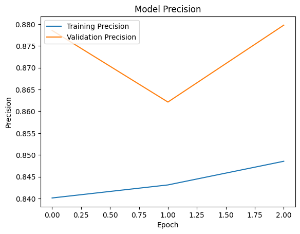

# LuaLuaLua report
 
## Task Description
This project is our solution for the [Natural Language Processing with Disaster Tweets](https://kaggle.com/competitions/nlp-getting-started) competition on Kaggle.

Twitter has become an important communication channel in times of emergency.
The ubiquitousness of smartphones enables people to announce an emergency they’re observing in real-time. Because of this, more agencies are interested in programatically monitoring Twitter (i.e. disaster relief organizations and news agencies).

But, it’s not always clear whether a person’s words are actually announcing a disaster.

In this competition, we were challenged to build a machine learning model that predicts which Tweets are about real disasters and which one’s aren’t. We have been given access to a dataset of 10,000 tweets that were hand classified.

## Implementation
We decided to base our solution on a pretrained model called GloVe. GloVe, which stands for Global Vectors for Word Representation, is a popular word embedding technique that captures semantic relationships between words in a vector space. This model is a straightforward word-vectorization model, which uses a 50-dimensional vector for each word. In this model (as in other word-vector models), each word is represented by an n-dimensional vector. The "distance" between vectors represents the similarity between words. Distance is calculated using the Pythagorean theorem, as the square root of the sum of squared differences. For instance, the distance between words like "mug" and "cup" is small, as they are similar and can often be used interchangeably in a sentence. However, words like "tractor" and "skyscraper" are positioned far apart in the vector space due to their distinct meanings.

There are, of course, other word-to-vector models, but we chose GloVe for our initial attempt due to its simplicity and ease of use and we found it good enough for our current purposes, so we got stuck with it. 

### Data processing
To use GloVe we needed to encode our text input into word-vectors, but first the tweets needed cleaning. 
1. **Cleaning the Text**:  
   - Removing *stopwords* (e.g., "of," "for," "with," "haven't," "by"). These are common words that usually add little value to the analysis.  
   - Eliminating non-letter characters, including numbers.  
   - Replacing links with a `[link]` placeholder.  

   Surprisingly, `[link]` became the most frequent "word" in our dataset, far outpacing any other term.  

     
   *Distribution of words in training data*  

   The abundance of `[link]` is likely due to the large number of tweets that included images or other shared content. Since links don't convey much meaning, we decided to remove them entirely from the dataset.  
   Actually, after completing the model, we were courious about the fact that how the cleaning affects the output of the model, since despite the fact, that these words do not carry information, the connection between the words might be useful. So we just simply removed the cleaning commands form the code. Here is the comparsion of the confusion matrix between the models with and without the text cleaning:
   
   
   
   As it can be seen, cleaning does not affect the out very much, but its got a slightly better performance, so we just kept the orginal form.
3. **Addressing Retweets and Usernames**:  
   After removing links, we noticed a significant number of meaningless words remaining in our dataset. Among the most common was `RT`, which we soon realized indicates retweets. Additionally, many other frequent "words" appeared to be fragments of usernames from retweet headers (e.g., `@user1234`). These usernames commonly don't carry much important information, so we removed them together with the retweet headers.

4. **Tokenizing the tweets**:
   After cleaning we tokenized each tweet into a list of words. We plotted the distribution of tweet lengths.
   
   
   
   *Distribution of number of tokens per cleaned tweet*
   
   We needed all inputs for our model to be the same in length. 99% of the words tweets is 17 or less words long so we truncated the longer tweets and padded the shorter ones.

### Embedding matrix
The embedding matrix is created from the GloVe dataset. It represents the information carried by word vectors in a different data structure, which can be incorporated into the model.

   
## Evolution of the Model
Basic architecture

### 1. LSTM 
**Model:** The first model (whitch we created to the II. Milestone) used LSTM (Long Short-Term Memory) architecture, but it was just kind of a dummy.

**Evalutaion:**
The result were quite poor, but the task for the II. Milestone was to prepare everything in our notebook except the model, so it did the job. The confusion matrix looked like this:

### 2. Improved LSTM
**Model:** The second model has been the most successful so far. This model uses an embedding layer with GloVe preloaded. Bidirectional LSTM cells are employed to capture context in the tweets, and a 50% dropout layer is applied to reduce overfitting. The output is a number between 0 and 1, where values above 0.5 are interpreted as "disaster" and those below as "non-disaster."

To further mitigate overfitting, the model incorporates techniques such as EarlyStopping, ModelCheckpoint, and ReduceLROnPlateau. Hyperparameter optimization is also implemented: the parameters learned from the first model fitting are used to improve the performance of the second model.

**Evalutaion:**

### 3. Two phase learning
**Model:**
**Evalutaion:**

### 4. Stacked Model: GRU-LSTM
**Model:** The final model uses an embedding layer with GloVe loaded. Then it uses two parallel layers, a Bidirectional LSTM for capturing context in the tweets and a GRU to capture different patterns and improve generalization. Then it uses a Dense layer for classification, a 50% droput layer to reduce overfitting, and finally an output Dense layer for binary classification. To eliminate overfitting we use: early stopping, checkpointing, and learning rate reduction.
**Evalutaion:**

## Conclusion
Predicting the real meaning of disastrous tweets is not an easy task. Beyond the literal meaning of words, the model must detect humor, sarcasm, personification, figurative speech, and other verbal tools commonly used by humans. The short format of tweets makes this task even more challenging.

To process the tweets, we used the GloVe word-vectorization tool and a complex convolutional network that integrates LSTM and GRU layers in parallel.

Despite our efforts to optimize hyperparameters and employ the advanced model described above, the accuracy of the model reached only 0.8132. While this might not seem high at first glance, considering the challenges outlined, I believe it is a respectable achievement.

## About AI usage
