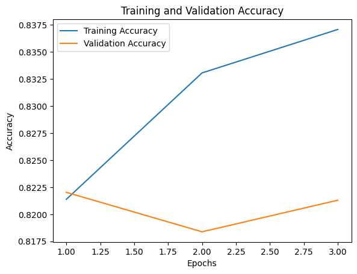

# LuaLuaLua report (Megajánlott jegyért)
 
## Task Description
This project is our solution for the [Natural Language Processing with Disaster Tweets](https://kaggle.com/competitions/nlp-getting-started) competition on Kaggle.

Twitter has become an important communication channel in times of emergency.
The ubiquitousness of smartphones enables people to announce an emergency they’re observing in real-time. Because of this, more agencies are interested in programatically monitoring Twitter (i.e. disaster relief organizations and news agencies).

But, it’s not always clear whether a person’s words are actually announcing a disaster.

In this competition, we were challenged to build a machine learning model that predicts which Tweets are about real disasters and which one’s aren’t. We have been given access to a dataset of 10,000 tweets that were hand classified.

## Implementation
We decided to base our solution on a pretrained model called GloVe. GloVe, which stands for Global Vectors for Word Representation, is a popular word embedding technique that captures semantic relationships between words in a vector space. This model is a straightforward word-vectorization model, which uses a 50-dimensional vector for each word. In this model (as in other word-vector models), each word is represented by an n-dimensional vector. The "distance" between vectors represents the similarity between words. Distance is calculated using the Pythagorean theorem, as the square root of the sum of squared differences. For instance, the distance between words like "mug" and "cup" is small, as they are similar and can often be used interchangeably in a sentence. However, words like "tractor" and "skyscraper" are positioned far apart in the vector space due to their distinct meanings.

There are, of course, other word-to-vector models, but we chose GloVe for our initial attempt due to its simplicity and ease of use and we found it good enough for our current purposes, so we got stuck with it. 

### Data processing
To use GloVe we needed to encode our text input into word-vectors, but first the tweets needed cleaning. 
1. **Cleaning the Text**:  
   - Removing *stopwords* (e.g., "of," "for," "with," "haven't," "by"). These are common words that usually add little value to the analysis.  
   - Eliminating non-letter characters, including numbers.  
   - Replacing links with a `[link]` placeholder.  

   Surprisingly, `[link]` became the most frequent "word" in our dataset, far outpacing any other term.  

     
   *Distribution of words in training data*  

   The abundance of `[link]` is likely due to the large number of tweets that included images or other shared content. Since links don't convey much meaning, we decided to remove them entirely from the dataset.  
   After completing the model, we became curious about how removing the stopwords affects the output of the model, while these words do not carry information directly, however the connection between the words might be useful. So we just simply removed the cleaning commands form the code. Here is the comparsion of the confusion matrix between the models with and without the cleaning:
   
   
   
   *Confusion matrix without removing the stopwords*
   
   It can be seen, that the cleaning does not have a significant impact on the result. Given it  has got a slightly better performance, we just kept the original form.

3. **Addressing Retweets and Usernames**:  
   After removing links, we noticed a significant number of meaningless words remaining in our dataset. Among the most common was `RT`, which we soon realized indicates retweets. Additionally, many other frequent "words" appeared to be fragments of usernames from retweet headers (e.g., `@user1234`). These usernames commonly don't carry much important information, so we removed them together with the retweet headers.

4. **Tokenizing the tweets**:
   After cleaning, we tokenized each tweet into a list of words. We plotted the distribution of tweet lengths.
   
   
   
   *Distribution of number of tokens per cleaned tweet*
   All inputs for our model needed to be the same length. Since 99% of the tweets contain 17 or fewer words, the longer tweets were truncated, and the shorter ones were padded.

### Embedding matrix
The embedding matrix is created from the GloVe dataset. It represents the information carried by word vectors in a different data structure, which can be incorporated into the model.

## Evolution of the Model
### The basic model
The input layer is an embedding layer that incorporates the GloVe embedding matrix. Following this, the core processing layers include a GlobalMaxPooling1D layer, which reduces the dimensionality by selecting the maximum value across each feature dimension. The output layer employs a sigmoid activation function, making it well-suited for binary classification tasks. The output is a number between 0 and 1. Values above 0.5 are interpreted as "disaster" and those below as "non-disaster".

### 1. LSTM 
**Model:**
The initial model for the second milestone used an LSTM (Long Short-Term Memory) layer as a preliminary implementation. It served as a placeholder for developing the notebook's foundational components.

**Evaluation:**
While performance was limited, the model met the milestone's requirements. The confusion matrix is as follows:

### 2. Improved LSTM
**Model:** 
The second model has been the most successful so far. This model uses  bidirectional LSTM cells to capture context in the tweets. A 50% dropout layer is applied to reduce overfitting.

To further reduce overfitting, the model incorporates techniques such as EarlyStopping, and ReduceLROnPlateau. 

Hyperparameter optimization using keras-tuner was employed to enhance the model. 

**Evalutaion:**

The model achieves a quite acceptable accuracy.

The confusion matrix:

### 3. Stacked Model: GRU-LSTM
**Model:** The final model employs a parallel architecture with a bidirectional LSTM and a GRU (Gated Recurrent Unit) layer to capture patterns in the data and enhance generalization. These layers are followed by a Dense layer for feature extraction and a 50% Dropout layer to mitigate overfitting. The model concludes with an output Dense layer utilizing a sigmoid activation function for binary classification, as used before. 

The model is further imrpoved by a **2 phase training** method.
In the first phase the training of the embdeding layer is disabled, while in the second phase it is enabled.

*Block diagram of the model architecture*

Hyperparameter optimization was performed as before, which is not included in the final notebook, as it makes the training unreasonably long, leading to problems with Google Colab usage limits. However the results from the optimization are reflected in the model. The code for the hyperparameter optimization can be seen on the `gru-lstm-hyperopti` branch on GitHub.

**Evalutaion:**
The final confusion matrix can be seen below:

The result is unexpectedly somewhat worse than the 2nd model. However we were able to run the training longer without overfitting. Given the path and the fact that this model better resembles our work it was chosen as the final one.

## Conclusion
Predicting the real meaning of disastrous tweets is not an easy task. Beyond the literal meaning of words, the model must detect humor, sarcasm, personification, figurative speech, and other verbal tools commonly used by humans. The short format of tweets makes this task even more challenging.

Despite our efforts to optimize hyperparameters and employ the advanced model described above, the accuracy of the model reached only 81.32% (the second version reached 83.44%). 
To process the tweets, we used the GloVe word-vectorization tool and a complex convolutional network that integrates LSTM and GRU layers in parallel. We are aware that the problem has solutions with close to 99% accuracy from the Kaggle competition. It is suspected that those solutions could rely on the BERT or other transformer models. However, these models are more computationally intensive and complex to train, it was determined that they would not align with our chosen approach.

## About AI usage
We used LLMs primarily in three areas:
1. LLMs were used to provide high-level suggestions and solution strategies for specific challenges. These served as a foundation for deeper research and refinement tailored to our needs.
2. Formatting: LLMs were used in improving code structure, formatting, and documentation, ensuring clarity and professionalism in both implementation and explanation.
3. Research: LLMs were used to clarify technical concepts (e.g., LSTM) and to explore methods applicable to our specific problem, enabling more informed decision-making.
